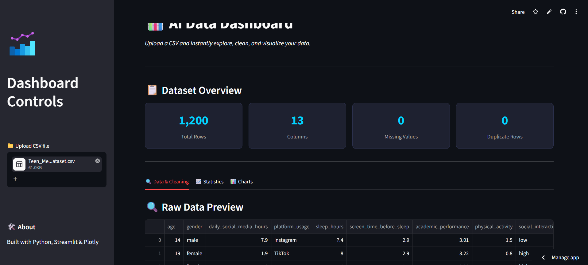

## 🔗 Links
- **Live App:** https://etnik-ai-dashboard.streamlit.app
- **GitHub:** https://github.com/etnikbabalija96-ui/ai-dashboard


# 📊 AI Data Dashboard

An interactive data dashboard built with Python, Streamlit and Plotly.

## Features
- 📁 Upload any CSV file
- 🧹 Data cleaning tools (remove duplicates, handle missing values)
- 📈 Auto-generated statistics and visualizations
- 📊 Interactive charts (histogram, scatter plot, bar chart, heatmap)
- ⬇️ Export cleaned data as CSV

## Tech Stack
- Python
- Streamlit
- Pandas
- Plotly

## How to Run
```bash
pip install streamlit pandas plotly
streamlit run app.py
```

## Screenshots

